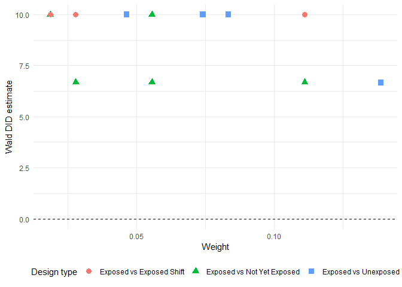

<!-- README.md is generated from README.Rmd. Please edit that file -->

# twfeivdecomp

<!-- badges: start -->

<!-- badges: end -->

## Overview

`twfeivdecomp` is a package for decomposing the two-way fixed effects
instrumental variable (TWFEIV) estimator under staggered instrumented
difference-in-differences (DID-IV) designs.  
The package decomposes the TWFEIV estimator into a weighted average of
all possible Wald-DID estimators, providing a transparent view of how
different 2x2 comparisons contribute to the overall estimate.

The decomposition can be performed both with and without time-varying
controls.

## Installation

You can install the development version of twfeivdecomp from GitHub:

``` r
library(devtools)
install_github("shomiyaji/twfeiv-decomp")
```

## Functions

\-`twfeiv_decomp()`: decomposes the TWFEIV estimator into all possible
Wald-DID estimators, with or without time-varying controls.

## Data

The package includes an example dataset `simulation_data`, which is a
small simulated panel dataset.  
It contains 72 observations (12 units observed over 6 time periods) with
the following variables:

- `id`: Unit identifier  
- `time`: Time period (2000–2005)  
- `instrument`: Binary instrument variable  
- `treatment`: Treatment variable  
- `outcome`: Outcome variable  
- `control1`, `control2`: Additional control variables

## Example

This is a basic example which shows how to decompose the TWFEIV
estimator into its Wald-DID components using the `twfeivdecomp` package.

``` r
library(twfeivdecomp)
decomposition_result <- twfeiv_decomp(outcome ~ treatment | instrument,
                                      data = simulation_data,
                                      id_var = "id",
                                      time_var = "time",
                                      summary_output = F)

# Decomposition result
head(decomposition_result)
#>   exposed_cohort unexposed_cohort                design_type Wald_DID_estimate
#> 1           2001             2002 Exposed vs Not Yet Exposed          6.666667
#> 2           2005             2002   Exposed vs Exposed Shift         10.000000
#> 3           2003             2002   Exposed vs Exposed Shift         10.000000
#> 4           2002             2001   Exposed vs Exposed Shift         10.000000
#> 5           2005             2001   Exposed vs Exposed Shift         10.000000
#> 6           2003             2001   Exposed vs Exposed Shift         10.000000
#>       weight
#> 1 0.02777778
#> 2 0.02777778
#> 3 0.02777778
#> 4 0.07407407
#> 5 0.07407407
#> 6 0.11111111

# Print the summary
print_summary(data = decomposition_result, return_df = FALSE)
#> # A tibble: 3 × 3
#>   design_type                weight_sum Weighted_average_Wald_DID
#>   <chr>                           <dbl>                     <dbl>
#> 1 Exposed vs Exposed Shift        0.333                     10   
#> 2 Exposed vs Not Yet Exposed      0.324                      8   
#> 3 Exposed vs Unexposed            0.343                      8.65

# Print the figure
library(ggplot2)

ggplot(decomposition_result) +
  aes(x = weight, y = Wald_DID_estimate, 
      shape = factor(design_type), 
      color = factor(design_type)) +
  geom_point(size = 3) +
  geom_hline(yintercept = 0, linetype = "dashed") +
  theme_minimal() +
  labs(x = "Weight", y = "Wald DID estimate", 
       shape = "Design type", color = "Design type") +
  theme(
    legend.position = "bottom",     
    legend.box = "horizontal"       
  )
```



## References

- Miyaji, Sho. (2024). *Instrumented Difference-in-Differences with
  Heterogeneous Treatment Effects.*  
  arXiv:2405.12083. Available at: <https://arxiv.org/abs/2405.12083>

- Miyaji, Sho. (2024). *Two-Way Fixed Effects Instrumental Variable
  Regressions in Staggered DID-IV Designs.*  
  arXiv:2405.16467. Available at: <https://arxiv.org/abs/2405.16467>
